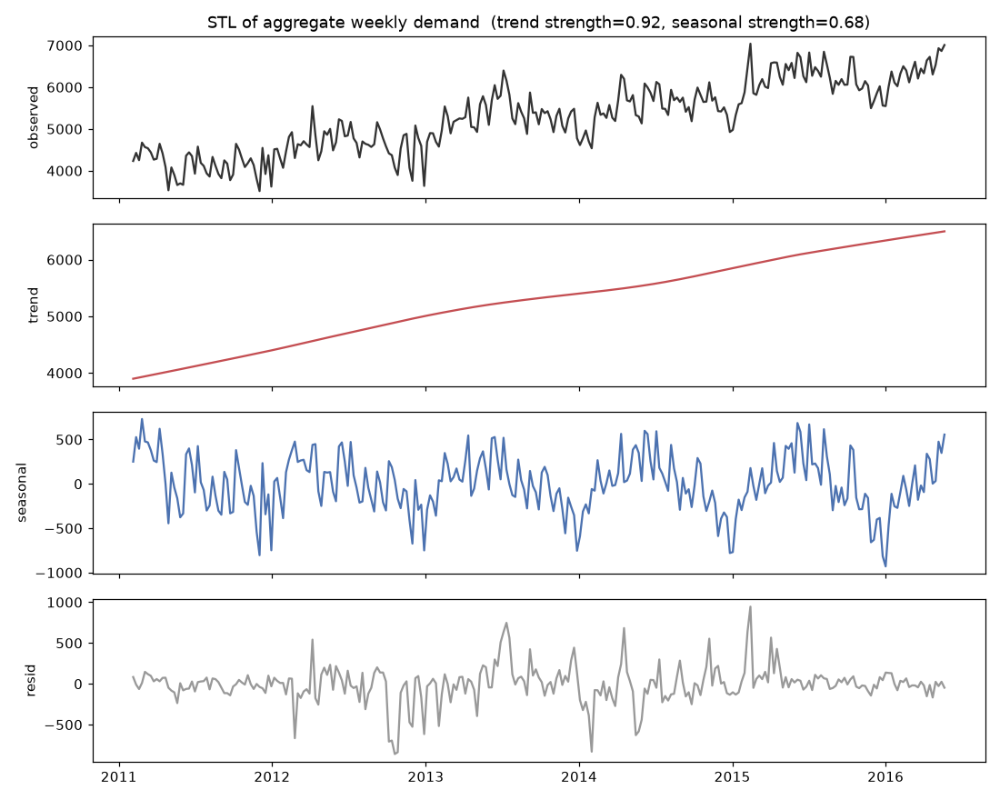
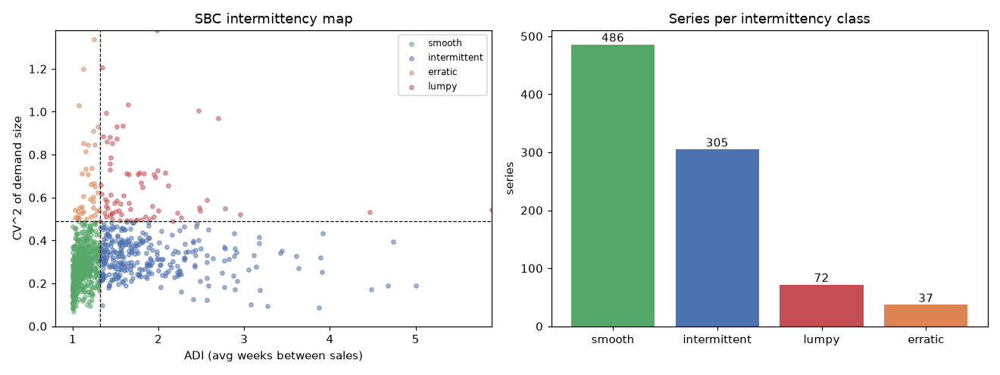
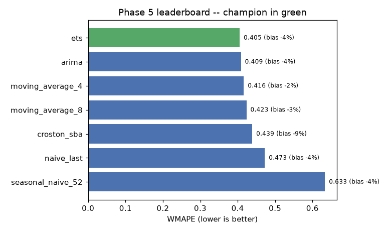
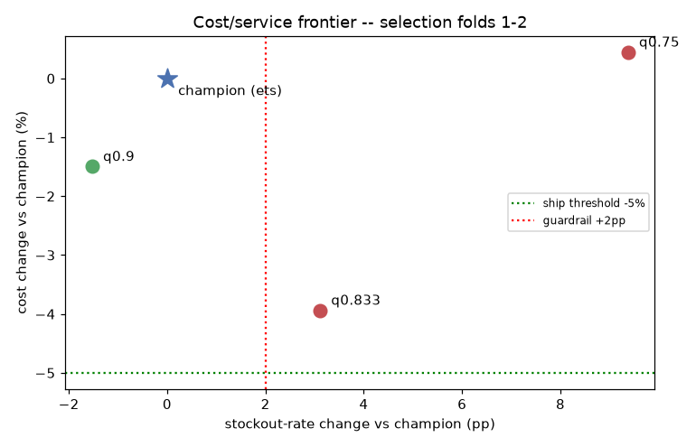
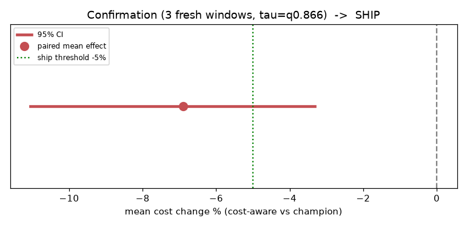

# Weekly Demand Forecasting — a decision system, not just a model

[](https://github.com/SwayamDesai/demand-forecasting-ab-testing/actions/workflows/ci.yml)
&nbsp;
&nbsp;

Retail demand forecasting on the Walmart **M5** dataset, built at the **weekly** grain to cut
the daily noise, and carried all the way to an honest deploy decision:

> **clean data → weekly signal → diagnostics → champion → ML/DL challengers → a strong A/B test → go/no-go.**

The point isn't "I trained a model." It's the full chain a real team uses to decide
whether a new forecast is worth shipping — and the discipline to say **no** when it isn't.

---

## Why weekly

Daily M5 demand is dominated by noise: **62% of active series-days are zero sales**.
Aggregating to the Walmart weekly grain collapses that to **24%** (and just **12%**
volume-weighted). Same data, far better signal-to-noise — so every model below forecasts
weekly, 4 weeks ahead.

| grain | active zero-rate |
|---|---|
| daily | 62.2% |
| **weekly** | **23.9%** (12.4% volume-weighted) |

---

## Headline result

Rolling-origin backtest (3 folds × 4-week horizon), primary metric **WMAPE**
(volume-weighted), with **MASE** and **bias** alongside.

| model | WMAPE | bias | MASE (med) | |
|---|---|---|---|---|
| **lightgbm** | **0.4026** | −0.9% | 0.658 | most accurate challenger |
| ets (champion) | 0.4054 | −3.7% | 0.665 | classical champion |
| lstm seq2seq | 0.4118 | −1.6% | 0.654 | competitive, well-calibrated |
| moving_average_4 | 0.4164 | −2.5% | 0.672 | |
| croston_sba | 0.4389 | −8.6% | 0.679 | intermittent specialist |
| naive_last | 0.4726 | −4.5% | 0.771 | |
| seasonal_naive_52 | 0.6335 | −3.5% | 0.942 | weak: per-SKU seasonality is only moderate |

**Then the twist that makes this a decision project, not a leaderboard:**

A controlled A/B test simulates the weekly ordering decision each model would drive
(newsvendor policy, 5:1 stockout:holding) and measures **money**. LightGBM is *more
accurate* than ETS — but on the paired counterfactual test it costs **+1.2% more**
(p≈0.045), because its better-centered forecasts over-order the expensive high-volume and
lumpy SKUs. A cost-ratio sensitivity sweep (3:1 → 9:1) never reaches the ship threshold.

> **Verdict: HOLD.** Accuracy ≠ business value. The disciplined call is to keep the
> simpler, well-understood ETS champion rather than adopt ML complexity for no business gain.

**Phase 8b — the cost-aware follow-up.** Instead of chasing accuracy, we retrained LightGBM
with **pinball (quantile) loss** so it predicts the cost-optimal *order quantity* directly
(the newsvendor 0.833-quantile). Honest protocol: τ swept on folds 1–2 only, winner (τ=0.9)
confirmed once on untouched fold 3. Result: **−5.6% cost with −0.75pp stockouts** (better
service), CI [−9.7%, −1.7%] — but the pre-registered Wilcoxon test came back p=0.13, because
the entire saving concentrates in the top-10% costliest SKUs while the median series is flat.
A mean-based test (what total dollars follow) gives p=0.007 — but that's post-hoc, so the
verdict stays **HOLD**, with the fix pre-registered for the next confirmation: a mean-based
primary test and τ≈0.85–0.87.

**Phase 8c — the pre-registered retest: SHIP.** The follow-up written down in the 8b
post-mortem, executed on **24 fresh weeks no model was ever scored on** (the windows before
fold 1), with the dollars-based paired test as the declared primary. τ selected on the 3 older
windows (winner τ=0.866), confirmed once on the 3 newer: **−6.9% cost** (paired-t p=5×10⁻⁴,
95% CI [−11.1%, −3.3%]), stockouts **+0.65pp** — inside the guardrail. Both tests now agree
(Wilcoxon p=1×10⁻³). All three pre-registered gates pass → **SHIP**, scoped to the stated 5:1
economics: the sensitivity sweep shows the win is specific to ~5:1 (at 3:1 or 9:1 you'd retune
τ before deploying), so the rollout recommendation is a monitored pilot with the cost ratio
validated in production.

*The full arc — accuracy didn't pay (HOLD) → diagnosed the mechanism → fixed the right lever
(the order, not the forecast) → promising but non-significant (HOLD, lesson recorded) →
pre-registered retest on fresh data → a defensible SHIP. That's a decision process, not a
leaderboard.*

---

## Full-M5 scale-up: all 30,490 series on a 16GB laptop

The entire pipeline was then scaled 34× to the **full M5 dataset** (30,490 store-SKU series,
10 stores) using the discipline the M5 winners used: **per-store chunked ETL** (never
materialize the 59M-row daily frame), int16/float32/category dtypes, **one LightGBM per
store**, and per-store checkpoints so every step is resumable. Total runtime **~20 minutes,
peak RAM 4.5GB**. ETS/ARIMA/LSTM are deliberately excluded at this scale (hours of per-series
CPU for no decision value — the fast baselines set the floor).

**Accuracy (30,490 series):** per-store LightGBM WMAPE **0.3706** vs 0.3875 for the best
simple baseline (ma4) — a 4.4% edge that *grew* with scale (0.7% at 900 series).

**The A/B at n=30,474 paired series — SHIP, decisively:**

| gate | result |
|---|---|
| mean cost reduction ≥ 5% | **−14.1%** (CI [−15.3%, −12.9%], p≈10⁻¹¹⁰) |
| stockout guardrail ≤ +2pp | +1.57pp |
| τ (selected folds 1–2, confirmed fold 3) | **0.866 — same as the 900-series retest** |

- **All 10 stores save money** (−5.9% to −23.0%) → supports a staged store-level rollout.
- **Policy isolation:** vs LightGBM-mean + safety stock, quantile ordering still saves −9.4%
  — the ordering policy, not just the model, drives the gain.
- Scale-appropriate testing: the mean-based paired test is pre-registered, and at this n the
  **≥5% practical-significance gate carries the decision** (p-values collapse for trivial
  effects at 30K pairs). SHIP also holds at 3:1 economics; 9:1 would need τ retuned.


---

## The phases (each gated by its own quality checks)

| # | phase | what it produces | headline |
|---|---|---|---|
| 1 | Data cleaning | clean daily tidy table | 12/12 quality checks pass |
| 2 | Preprocessing | weekly grain + leakage-safe features | lossless agg; leakage test passes |
| 3 | EDA | demand/intermittency/seasonality/exogenous | SBC classes; SNAP is nonlinear (use the count) |
| 4 | TS diagnostics | stationarity, STL, ACF/PACF, transform | d≤1; seasonal 52; log/Tweedie justified |
| 5 | TS models | classical bake-off | **champion = ETS (0.4054)** |
| 6 | ML | global Tweedie LightGBM (recursive) | beats ETS by 0.7%, bias −0.9% |
| 7 | DL | seq2seq LSTM (mean-scaled, no collapse) | competitive, bias −1.6% |
| 8 | A/B test | newsvendor sim + paired/unpaired + guardrails | **HOLD** (honest no-go) |
| 8b | Cost-aware retrain | quantile-loss LightGBM orders the τ\*-quantile directly | −5.6% cost, better service — **HOLD** on the pre-registered test, retest specified |
| 8c | Pre-registered retest | fresh 24 weeks, dollars-based paired test, τ=0.866 | **SHIP**: −6.9% cost (p=5×10⁻⁴), stockouts +0.65pp |
| F1 | Full-M5 ETL | per-store chunked raw→weekly (30,490 series) | 68s, 3.7GB peak, all stores reconcile |
| F2 | Full-M5 models | vectorized baselines + 10 per-store LightGBMs | champion WMAPE **0.3706** (~5 min) |
| F3 | Full-M5 A/B | quantile ordering vs ma4+safety-stock, n=30,474 | **SHIP**: −14.1% cost, all 10 stores negative |

---

## What makes the A/B "strong"

- **Business simulation**: each forecast becomes an order; mistakes priced as understock
  vs overstock (newsvendor, `order = forecast + z(τ*)·σ`).
- **Pre-registered decision rule** stated before seeing results.
- **Paired counterfactual test** (correct, higher-power for an offline backtest) *and* an
  unpaired stratified test (mimics a live experiment) — they agree it's not a cost win,
  and the unpaired's wide CI shows why paired is the right design.
- **Power analysis** (MDE), a **stockout-rate guardrail**, and a **cost-ratio sensitivity**
  sweep on the verdict's biggest assumption.

---

## Selected visuals

Weekly aggregation makes the signal visible — clear trend + yearly seasonality:


The intermittency map that drives the model choices (SBC taxonomy):


The classical bake-off — ETS is the champion every challenger must beat:


The cost/service frontier that picked the cost-aware policy (Phase 8b selection):


The verdict: confirmation CI entirely below zero, past the −5% ship line:


---

## Rigor & honesty

- **No leakage**: time-only splits; every lag/rolling feature `.shift()`-ed; a unit test
  (`tests/test_features.py`) perturbs the current week and fails if any feature moves.
  Scalers/stats fit on train only.
- **Reproducible**: fixed seeds; the slow classical CV is cached; `make`-style phase scripts.
- **Tested**: 18 unit tests run in CI (metrics, backtest folds, the feature **leakage guard**,
  newsvendor + paired/unpaired stats).
- **Honest EDA**: caught and corrected three inflated effect sizes (SNAP, promo, events)
  that a naive index-then-average method produced.
- **Honest verdicts**: two HOLDs we refused to fudge (including one where switching the test
  post-hoc would have "passed"), then a SHIP earned on fresh data with the rule declared first.

---

## Repo layout

```
src/        config, io, metrics, backtest, experiment    (shared modules, unit-tested)
scripts/    phase1_data_cleaning ... phase8c_retest      (one runnable step per phase)
tests/      pytest: metrics, backtest folds, feature leakage guard, A/B stats
reports/    per-phase figures, CSVs, and a SUMMARY.md each (all results are committed)
data/       not committed -- `make data` downloads the 3 M5 files from Kaggle
```

## How to run

```bash
make install                # python3.12 venv + requirements
make data                   # M5 from Kaggle (needs ~/.kaggle/kaggle.json)
source .venv/bin/activate

python -m scripts.phase1_data_cleaning
python -m scripts.phase2_preprocessing
python -m scripts.phase3_eda
python -m scripts.phase4_ts_diagnostics
python -m scripts.phase5_baselines      # ~8 min first run (AutoETS@52); cached after
python -m scripts.phase6_lightgbm
python -m scripts.phase7_lstm
python -m scripts.phase8_ab_test
python -m scripts.phase8b_cost_aware    # cost-aware quantile follow-up
python -m scripts.phase8c_retest        # pre-registered retest -> SHIP

# full-M5 scale-up (all 30,490 series; ~20 min total, <5GB RAM, checkpointed)
python -m scripts.full1_data            # chunked per-store ETL (68s)
python -m scripts.full2_models          # baselines + 10 per-store LightGBMs (~5 min)
python -m scripts.full3_ab              # quantile models + A/B at scale (~14 min)

pytest -q                               # 18 tests (also run in CI)
```

(or `make pipeline` for all ten sample-scale phases end-to-end)

*Tech: Python, pandas/numpy, statsforecast, LightGBM, PyTorch, scipy/statsmodels, matplotlib.*
*Data: Walmart M5, 2011–2016 — development at 900 series (3 stores × 3 cats × 100 items),
then scaled to the full 30,490 series across all 10 stores.*
