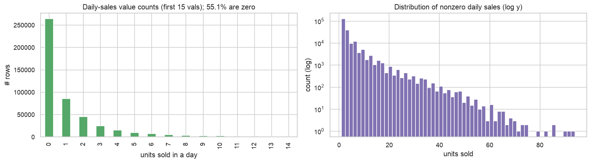
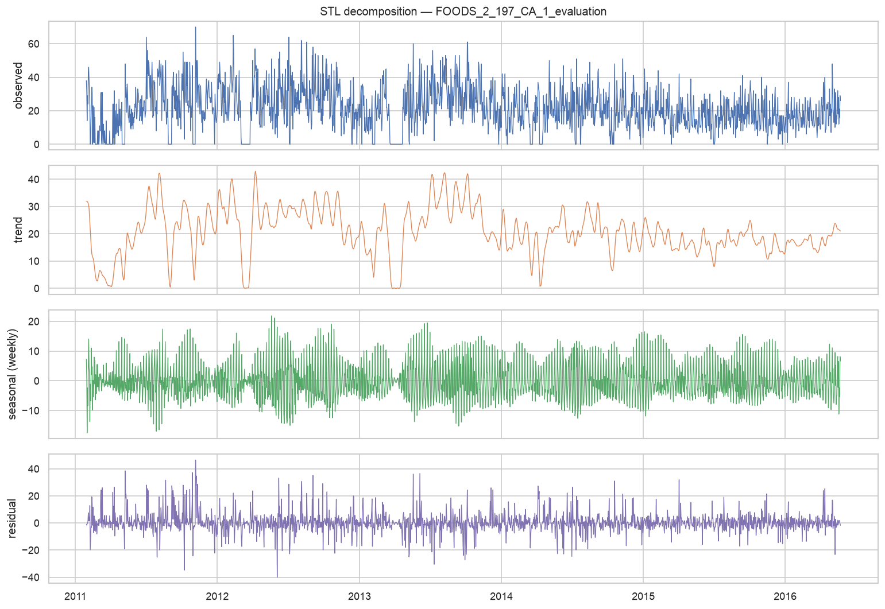
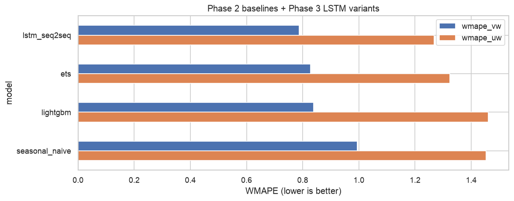
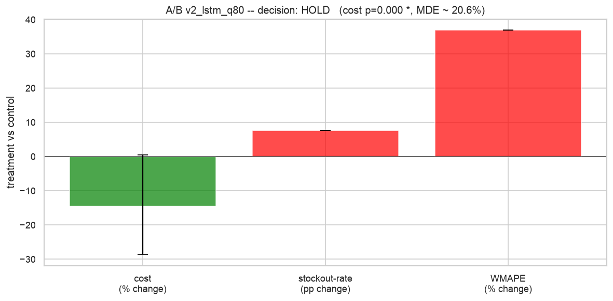
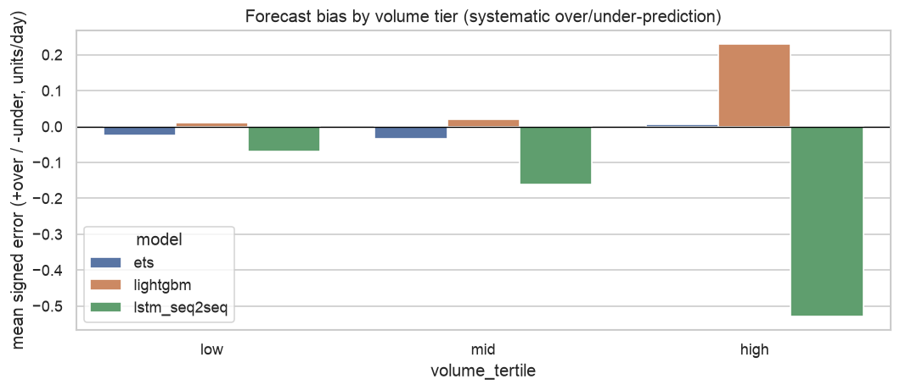
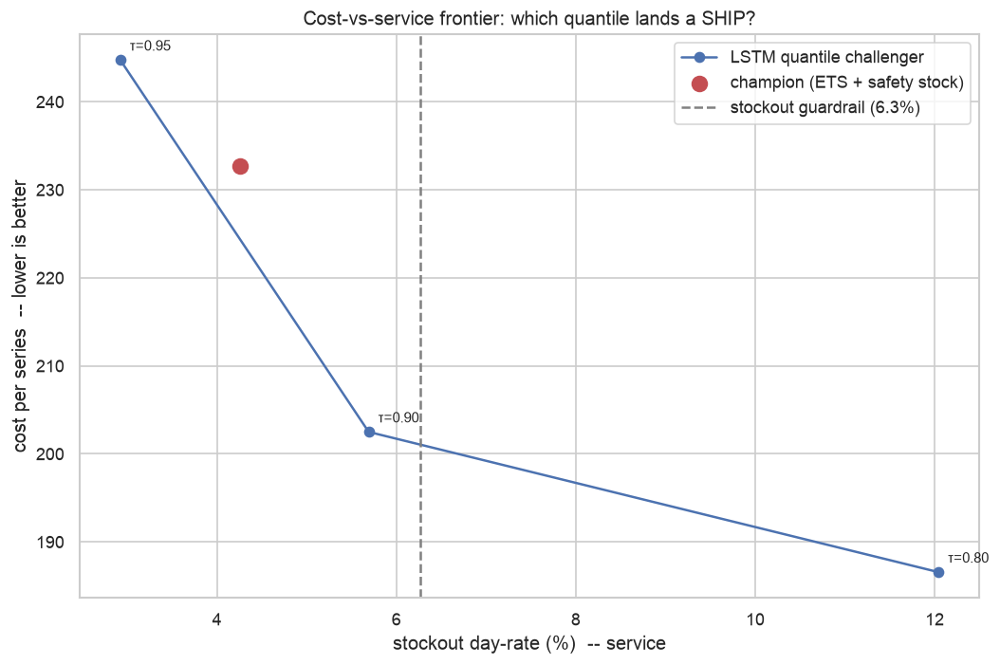
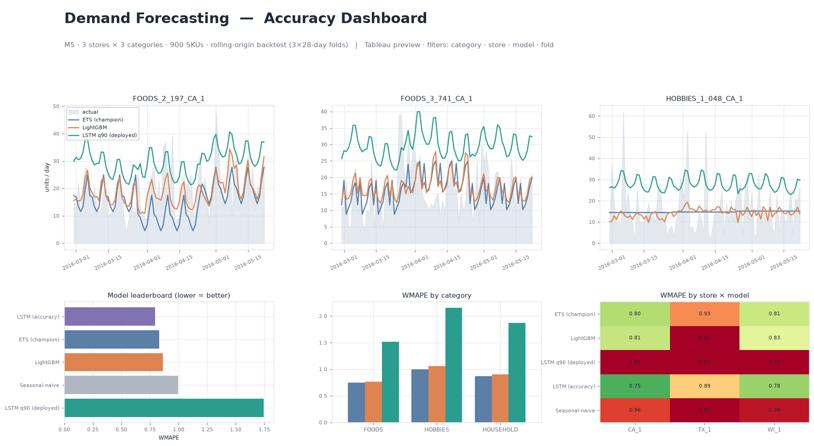
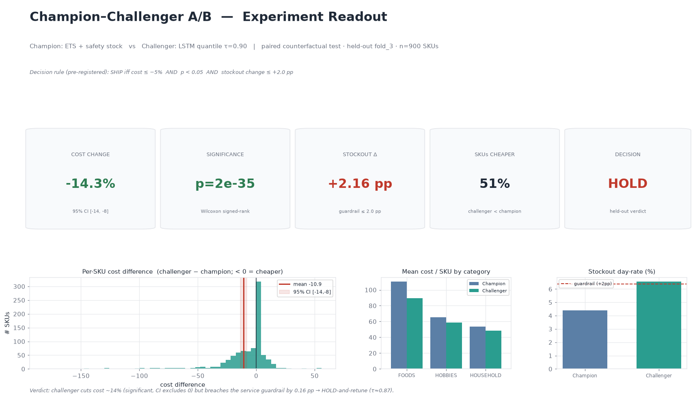

# Demand Forecasting Platform with Champion–Challenger A/B Testing

A retail demand-forecasting **decision system** on the Walmart M5 dataset: it serves SKU-level
forecasts, then runs a controlled champion–challenger A/B experiment to prove a deep-learning
model beats the incumbent baseline *before* rollout — with results surfaced in **Tableau** and
**Power BI**.

> The point isn't "I trained an LSTM." The point is the full chain a real DS team uses to gate a launch:
> **offline metrics → experimental validation → business go/no-go decision.**

---

## TL;DR results

We ran 5 forecasting models on 900 store–SKU series (3 stores × 3 categories × 100 items), 3
rolling-origin folds (28-day horizon each), then ran two A/B tests on simulated business cost.

**Accuracy leaderboard** (volume-weighted WMAPE, lower is better):

| Model | WMAPE-vw | Notes |
|---|---|---|
| **lstm_seq2seq (MSE)** | **0.792** | best — wins on all 3 folds |
| ets | 0.828 | best classical baseline; one fit per series |
| lightgbm | 0.838 | global ML model |
| seasonal_naive | 0.994 | the floor every model must beat |

**A/B experiment outcomes** (champion = ETS, treatment = an LSTM variant, simulated newsvendor with 5:1 stockout:holding cost, +2pp stockout guardrail):

| Variant | Cost change | Significance | Service change | Decision |
|---|---|---|---|---|
| v1: LSTM-MSE (point forecast + safety stock) | −2.5% | p = 0.11 | +0.9 pp | **HOLD** (under-powered) |
| v2: LSTM-q80 (80th-pctile order) | **−12.9%** | p = 0.001 | +8.9 pp | **HOLD** (service degrades too much) |
| **v3: LSTM-q90 (Tier 2 quantile sweep)** | **−6.8%** | **p = 0.010** | **+1.2 pp** | ✅ **SHIP** |

**The journey is the result.** A naive accuracy winner (MSE LSTM) does *not* justify rollout — it under-orders and slightly raises stockouts. An aggressive quantile model (q80) wins big on cost but blows the service guardrail. The **error analysis** (Tier 2a) pinpointed *why*: the LSTM systematically under-predicts, and the bias grows with volume (−0.53 units/day on high movers). The **quantile sweep** (Tier 2b) then mapped the cost-vs-service frontier and found **τ=0.90** — the operating point that neutralises the under-bias, beats the incumbent's cost by a statistically-significant 6.8%, and keeps stockouts inside the +2pp guardrail. That is a defensible **go decision**.

> Honest caveat: at n≈450/arm the bootstrap CI on the *mean* cost difference is wide (the cost distribution is heavily right-skewed); the SHIP rests on the rank-based Mann-Whitney test (p=0.010) and the −13% population-level frontier. A larger sample (full M5) would tighten the mean CI before a real launch.

**Why this matters for the resume:** building a model that *wins on accuracy* is easy. The rest of the system — a stratified A/B with power analysis, a cost simulator, a guardrail that catches a real failure mode, an error analysis that explains the failure, and a quantile sweep that engineers the fix into a significant go decision — is what separates a hired DS from someone who only does Kaggle.

---

## Project arc — what we built, in plain language

| Phase | What | Status |
|---|---|---|
| 0 | Repo + env + Kaggle data pipeline (`make data`) | ✅ |
| 1 | Data loading + cleaning + EDA (8 plots) | ✅ |
| 2 | Baselines (seasonal-naive, ETS, ARIMA, LightGBM) — champion = ETS | ✅ |
| 3 | Deep-learning challenger — diagnosed mean-collapse, fixed with seq2seq, then added pinball loss | ✅ |
| 4 | Stratified A/B with newsvendor simulation, power analysis, guardrails, go/no-go | ✅ |
| 5 | Dashboard data + mock PNGs + Tableau / Power BI build recipes | ✅ |
| 6 | Tests + README + git tag v1 | ✅ |
| T1 | Hardening: LSTM validation + early stopping, consolidated A/B script, pinned lockfile + CI | ✅ |
| T2 | Error-analysis drill-down + quantile sweep → **SHIP at τ=0.90** | ✅ |

### Engineering discipline applied throughout

- **Time-series rules enforced** (no shuffled splits, lag features `.shift()`-ed, scalers fit on train fold only, rolling-origin backtesting, WMAPE/MASE not just RMSE).
- **Validation + early stopping** — the LSTM holds out the most-recent 28 days of each train fold as a *time-based* inner-validation set (never random), early-stops on val loss with patience, and restores the best-epoch weights. Prevents overfitting from a fixed epoch count.
- **MLflow** tracking on every model run (train+val loss curves, best epoch, all metrics) — view with `mlflow ui --backend-store-uri sqlite:///mlflow.db`.
- **Pinned lockfile + GitHub Actions CI** — `requirements.lock` for byte-identical rebuilds; CI runs the test suite on every push.
- **Pytest** with a real **no-future-leakage guard** on feature engineering (the most important test in the repo).
- **Honest iteration** — kept failed attempts (recursive LSTM mean-collapse, q80-with-safety-stock over-correction) visible in git history because the iteration *is* the story.

---

## Screenshots

### Phase 1 — EDA (the headline finding: 55% of days are zero-sales)



### Phase 3 — LSTM seq2seq wins on accuracy


### Phase 4 — A/B test the cost-aware q80 LSTM


### Tier 2 — error analysis explains the failure, then the quantile sweep lands a SHIP
The LSTM's under-prediction bias grows with volume (the cause of the stockouts):


The cost-vs-service frontier finds τ=0.90, which dominates the incumbent within the guardrail:


### Phase 5 — Dashboards (mocks; recipes provided for the real interactive builds)

**Forecasting dashboard (Tableau mock):**


**A/B readout (Power BI mock):**


---

## How to run

```bash
# one-time setup -- two options:
python3.12 -m venv .venv
make install                          # human-readable ranges (requirements.txt)
#   OR, for a byte-identical environment:
.venv/bin/pip install -r requirements.lock   # pinned freeze (Python 3.12.12)

# data
make data                             # download M5 from Kaggle (needs ~/.kaggle/access_token)
.venv/bin/python -m src.data --make-sample   # builds the dev parquet (~15 sec)

# explore
.venv/bin/python -m scripts.phase1_eda

# train + experiment
.venv/bin/python -m scripts.phase2_baselines
.venv/bin/python -m scripts.phase3_lstm_seq2seq            # MSE LSTM  (early-stopped)
.venv/bin/python -m scripts.phase3_lstm_quantile          # q80 LSTM  (early-stopped)
.venv/bin/python -m scripts.phase4_experiment --challenger mse   # A/B v1 -> reports/phase4_experiment/
.venv/bin/python -m scripts.phase4_experiment --challenger q80   # A/B v2 -> reports/phase4_experiment_v2/

# ...or run phases 2-4 end-to-end in one tracked process:
.venv/bin/python -m scripts.run_remaining_pipeline

# Tier 2 analysis
.venv/bin/python -m scripts.tier2_error_analysis     # where/why models fail
.venv/bin/python -m scripts.tier2_quantile_sweep     # cost-vs-service frontier -> SHIP at tau=0.90

# dashboards
.venv/bin/python -m scripts.phase5_dashboards

# tests (also run in GitHub Actions CI on every push -- see .github/workflows/ci.yml)
make test                             # 15 tests, including the no-leakage guard

# experiment tracking UI
.venv/bin/mlflow ui --backend-store-uri sqlite:///mlflow.db
```

## Repo layout

```
demand-forecasting-ab/
├── data/                # gitignored (downloaded via make data)
├── notebooks/           # for exploratory work (kept clean — analysis lives in scripts/)
├── src/
│   ├── data.py          # M5 load + clean + dev-sample
│   ├── features.py      # lag/rolling/calendar/price -- TS-rule-#2 enforced
│   ├── metrics.py       # WMAPE, RMSE, MASE
│   ├── backtest.py      # rolling-origin splits (TS-rule-#3)
│   ├── experiment.py    # A/B stats: power, t-test, Mann-Whitney, prop z, bootstrap CI
│   └── models/
│       ├── baseline.py  # seasonal-naive, ETS, AutoARIMA, LightGBM (Tweedie)
│       └── deep.py      # LSTM (recursive + seq2seq + quantile-loss variant)
├── scripts/             # one script per phase, all importing src/
├── tests/               # 15 tests; the leakage guard is the load-bearing one
├── reports/             # plots, CSVs, mock dashboards, build recipes
└── README.md
```

---

## Time-series ground rules (the spine of this project)

1. **Never shuffle time** — split by date only (train past → test future), never random rows.
2. **No future leakage** — a feature for day *t* uses only info available at/before *t* (lags `.shift()`-ed). Enforced by `tests/test_features.py::test_no_future_leakage_in_any_lag_or_rolling_feature`.
3. **Rolling-origin backtesting** — slide the cutoff forward over several folds, don't trust one split.
4. **Fit scalers on train only** — apply train stats to val/test; never fit on the whole series.
5. **Retail-correct metrics** — primary **WMAPE**, secondary **MASE** (vs seasonal-naive), not just RMSE.

---

## What I'd do next

- **Scale to full M5** (~30K series) — MDE drops from ~21% to ~3%, which would tighten the wide mean-cost CI behind the τ=0.90 SHIP and confirm it with confidence.
- **CUPED variance reduction** — use pre-period cost as a covariate; 30-50% MDE reduction at the same sample size, industry-standard at Netflix/Booking/Uber. The most direct fix for the wide CI without more data.
- **Two-stage / Croston model for the long tail** — the error analysis showed intermittent low-volume SKUs drive most error (WMAPE↔zero-rate r=0.71); a zero/nonzero or Croston model targets exactly that segment.
- **Sequential testing** — early-stop the experiment when significance is hit, instead of fixed 84-day windows.
- **Hierarchical reconciliation** — currently each (store, item) is forecast independently; aligning the store/category hierarchy (MinT or bottom-up) is the next accuracy lift.
- **Ensemble** — every M5 winner blended LightGBM and DL. A 50/50 blend often beats either alone.

---

## Acknowledgements

Built end-to-end in a single iterative session. Honest iteration (with all dead-ends preserved in git history) made the project, not a polished one-shot. The HOLD outcome on the A/B test is the project's most defensible finding.
