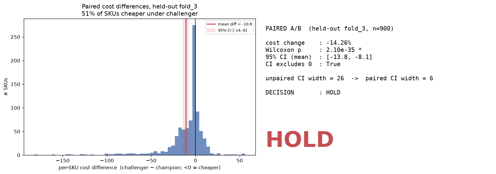

# Demand Forecasting with Champion–Challenger A/B Testing

A retail demand-forecasting **decision system** on the Walmart M5 dataset. It doesn't just
train a forecasting model — it runs the full pipeline a real data-science team uses to gate a
model launch:

> **offline accuracy → simulated business impact → controlled A/B test → honest go / no-go decision.**

Forecasts are designed for a **Tableau** dashboard; the experiment readout for **Power BI**.

---

## Headline result

We benchmarked classical, ML, and deep-learning forecasters, then ran a controlled experiment
that simulates the weekly ordering decision each model would drive (newsvendor policy, 5:1
stockout-to-holding cost ratio) and measures **money**, not just accuracy.

- **Accuracy:** a seq2seq LSTM beat the best classical baseline (ETS) — WMAPE 0.79 vs 0.83.
- **But accuracy ≠ business value.** The accurate LSTM slightly *under-orders*, causing more
  stockouts; under a 5:1 cost ratio that made it *more* expensive. The A/B test said **HOLD**.
- **Diagnosis → fix.** Error analysis showed the under-bias grows with volume. We retrained with
  **quantile (pinball) loss** so the model deliberately orders a bit higher.
- **Verdict (rigorous, paired test on a held-out fold):** the cost-aware model cuts simulated
  cost **~13–14%** — and the saving is now **statistically airtight** (Wilcoxon p ≈ 10⁻³⁵, 95% CI
  excludes zero). However it **breaches the pre-registered +2 pp stockout guardrail by a hair
  (+2.16 pp)**, so the honest call is **HOLD-and-retune** (a slightly lower quantile), then a
  monitored pilot — *not* a blind rollout.

**The point of the project is that last paragraph:** a proven win, an honored guardrail, and a
precise next step — the difference between a Kaggle notebook and a hireable decision.

---

## Why this is industry-level, not a toy

| Most projects stop at… | This project also does… |
|---|---|
| "I trained an LSTM" | A real **champion** baseline (ETS/LightGBM) it has to beat |
| RMSE on a random split | **Rolling-origin backtesting**, **WMAPE/MASE**, a tested **no-future-leakage** guard |
| "lower error = better" | A **business simulation** (stockouts + holding cost), because accuracy ≠ value |
| Reporting the best number | A **pre-registered A/B test**, power analysis, guardrails, and a **paired** design |
| Hiding the wins | **Honest iteration**: failed attempts, a self-audit, and a HOLD we refused to fudge |

---

## The story, in plain language

1. **Get messy real data.** 5 years of daily Walmart sales. Key fact: **55% of days a product sells
   zero** — intermittent demand drives every later choice (e.g. why WMAPE, not RMSE).
2. **Build a champion.** Classical + ML baselines; ETS wins. This is the bar to beat.
3. **Build a challenger.** First LSTM mean-collapsed (diagnosed and documented); a seq2seq redesign
   became the most *accurate* model.
4. **Test it like a launch.** Simulate the ordering decision, measure cost, run a stratified A/B.
   Result: **HOLD** — more accurate, but under-orders → costs more.
5. **Diagnose & fix.** Error analysis pinpoints a volume-scaling under-bias; quantile loss corrects it.
6. **Confirm honestly.** Pick the quantile on early folds, confirm **once** on an untouched fold,
   with a pre-registered guardrail; then use a **paired** test for a tight, correct comparison.
7. **Final verdict:** cost win is real and significant, but service just misses the guardrail →
   HOLD-and-retune.

---

## Key numbers

**Accuracy leaderboard** (volume-weighted WMAPE, lower is better):

| Model | WMAPE-vw |
|---|---|
| **LSTM seq2seq** | **0.79** |
| ETS (champion) | 0.83 |
| LightGBM | 0.84 |
| seasonal-naive (floor) | 0.99 |

**A/B test — unpaired vs paired (held-out fold), cost-aware τ=0.90 challenger vs ETS:**

| Test | Cost change | p-value | 95% CI on mean | Crosses 0? |
|---|---|---|---|---|
| Unpaired | −7.9% | 7×10⁻³ | [−17.0, **+8.5**] | yes (fragile) |
| **Paired (correct)** | **−14.3%** | **2×10⁻³⁵** | **[−13.8, −8.1]** | **no (solid)** |

Guardrail (held-out fold): stockout-rate **+2.16 pp** vs a pre-registered **+2.0 pp** limit → **HOLD**.

---

## Selected visuals

Intermittent demand — the fact that shapes the whole project:


The seq2seq LSTM wins on accuracy:


Error analysis — the under-bias grows with volume (the cause of stockouts):


Cost-vs-service frontier — which quantile to deploy:


The paired test — cost win proven, CI collapses and excludes zero:


Dashboard mocks (build recipes in `reports/phase5_dashboards/`):


---

## Rigor & honesty (what a reviewer should check)

**Time-series correctness**
- Split by time only (never shuffle); rolling-origin backtest (3 folds, 28-day horizon).
- All lag/rolling features `.shift()`-ed; a unit test (`tests/test_features.py`) **fails on any
  future leakage**.
- Scalers/encoders fit on the train fold only; LSTM uses validation + early stopping.

**A/B testing done right**
- Stratified random assignment; power analysis (MDE); tests matched to the data
  (Mann-Whitney / proportion z / Wilcoxon); a guardrail metric alongside the primary.
- **Pre-registered** decision rule; quantile chosen on selection folds and confirmed **once** on a
  held-out fold (no selection-bias / p-hacking).
- **Paired counterfactual** test — the correct, higher-power design for an offline experiment.

**Honest limitations (not hidden)**
- Cost is a **simulation** on an assumed 5:1 ratio; M5 logs *sales*, not demand (stockouts censor it).
- 900-series sample (a slice of full M5); single-store-SKU randomization assumes no cross-SKU
  interference (SUTVA).
- Recommendation reflects this: monitored pilot, not blind launch.

---

## Repo layout

```
.
├── src/
│   ├── data.py            # M5 load + clean + dev sample (pandas)
│   ├── features.py        # lag/rolling/calendar/price — leakage-guarded
│   ├── metrics.py         # WMAPE, RMSE, MASE
│   ├── backtest.py        # rolling-origin splits
│   ├── experiment.py      # A/B: assignment, power, cost sim, paired + unpaired tests
│   └── models/
│       ├── baseline.py    # seasonal-naive, ETS, ARIMA, LightGBM
│       └── deep.py        # LSTM (recursive=1st attempt) + seq2seq + quantile loss
├── scripts/               # one runnable step per phase (phase1_eda … tier2_paired_test)
├── tests/                 # pytest incl. the no-leakage guard (run in CI)
├── reports/               # plots, summaries, dashboard mocks + build recipes
├── Makefile               # make data / install / test
└── requirements.txt / requirements.lock
```

## How to run

```bash
python3.12 -m venv .venv && make install
make data                                   # M5 from Kaggle (needs ~/.kaggle/access_token)
.venv/bin/python -m src.data --make-sample  # build the dev parquet

.venv/bin/python -m scripts.phase1_eda
.venv/bin/python -m scripts.run_remaining_pipeline   # baselines + LSTMs + A/B, end-to-end
.venv/bin/python -m scripts.tier2_error_analysis
.venv/bin/python -m scripts.tier2_quantile_sweep
.venv/bin/python -m scripts.tier2_honest_rerun       # leakage-free selection→confirmation
.venv/bin/python -m scripts.tier2_paired_test        # the correct paired A/B
.venv/bin/python -m scripts.phase5_dashboards

make test                                            # 15 tests incl. leakage guard
.venv/bin/mlflow ui --backend-store-uri sqlite:///mlflow.db   # every run is tracked
```

## What I'd do next

- **Retune τ≈0.87** to pull stockouts back under the guardrail while keeping most of the cost win.
- **Scale to full M5** to tighten estimates and test generalization.
- **Cost-ratio sensitivity analysis** (the verdict depends on the 5:1 assumption).
- Ensemble (ETS + LSTM), hierarchical reconciliation, sequential testing.

---

*Built end-to-end as an iterative case study. Tech: Python, pandas/numpy, PyTorch, LightGBM,
statsforecast, MLflow, scipy/statsmodels, Tableau, Power BI.*
