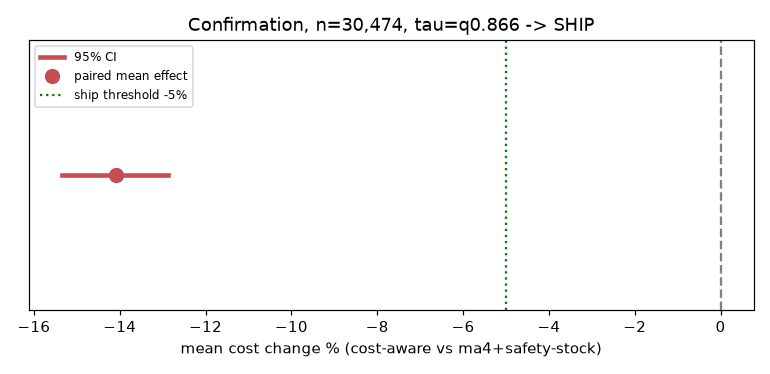
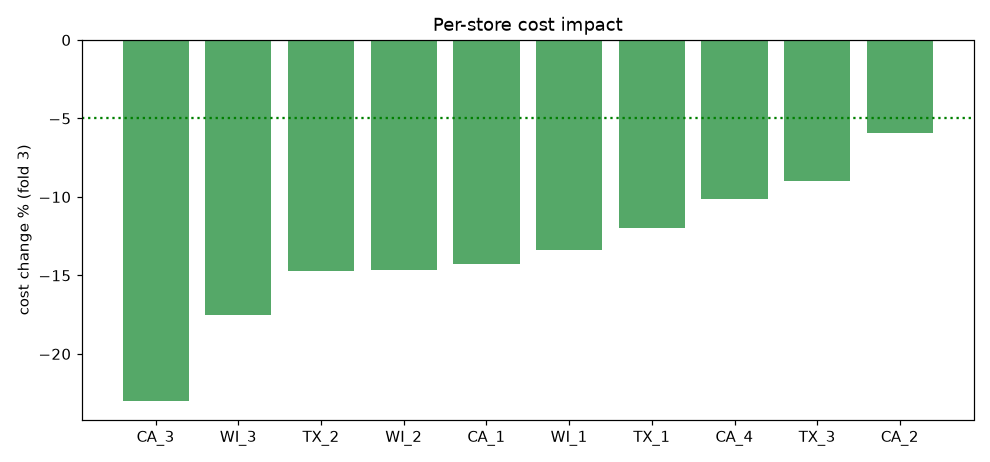

# Demand Forecasting with Cost-Aware A/B Testing

[](https://github.com/SwayamDesai/demand-forecasting-ab-testing/actions/workflows/ci.yml)
&nbsp;
&nbsp;

Retail demand forecasting on the **complete Walmart M5 dataset — all 30,490 store-SKU
series across 10 stores** — carried past the leaderboard to the question a real team has
to answer: *does the better model actually save money, and should it ship?*

> **weekly signal → per-store LightGBM → newsvendor cost simulation → pre-registered A/B test → SHIP at −14.1% cost.**

The whole pipeline runs on a 16GB laptop in ~20 minutes.

---

## Results

**Accuracy** (30,490 series, rolling-origin backtest: 3 folds × 4-week horizon, volume-weighted WMAPE):

| model | WMAPE | bias | MASE (med) |
|---|---|---|---|
| **lightgbm (one per store)** | **0.3706** | −1.2% | 0.635 |
| ma4 (best simple baseline) | 0.3875 | −1.3% | 0.650 |
| ma8 | 0.3975 | −2.8% | 0.648 |
| naive_last | 0.4283 | −5.3% | 0.733 |
| snaive_52 | 0.6218 | −12.9% | 0.916 |

**The A/B test** — control = the simple ordering system a retailer actually runs
(ma4 forecast + Gaussian safety stock); treatment = LightGBM trained with **pinball loss**
so it predicts the cost-optimal demand quantile *as the order quantity* (newsvendor,
5:1 stockout:holding). n = **30,474 paired series**:

| pre-registered gate | result | pass |
|---|---|---|
| mean cost reduction ≥ 5% | **−14.1%** (95% CI [−15.3%, −12.9%], p ≈ 10⁻¹¹⁰) | ✅ |
| stockout increase ≤ +2pp | +1.57pp | ✅ |
| verdict | **SHIP** | |

- **All 10 stores save money** (−5.9% to −23.0%) → supports a staged store-level rollout.
- **Policy isolation:** against LightGBM-mean + the same safety-stock policy, quantile
  ordering still saves **−9.4%** — the ordering policy, not just the model, drives the gain.
- **Sensitivity:** SHIP also holds at 3:1 economics; at 9:1 the quantile would be retuned
  first (reported, not hidden).




---

## Why weekly, and why these models

- **Weekly grain:** daily M5 demand is 62% zero-sales days — mostly noise. The Walmart
  week collapses that to ~24% zero-weeks (12% volume-weighted) with a 4-week horizon
  that matches an ordering cadence.
- **One LightGBM per store** (Tweedie objective for zero-inflated, multiplicative demand;
  recursive multi-step) — the pattern the M5 competition winners used. Per-series
  classical models (ETS/ARIMA) cost hours of CPU at 30K series and lost to fast baselines
  as champions-per-dollar; a seq2seq LSTM was evaluated during development and did not
  beat LightGBM. Both exclusions are deliberate and documented.
- **Quantile ordering:** the newsvendor-optimal order is the τ\* = cu/(cu+co) ≈ 0.833
  demand quantile. Instead of "mean forecast + z·σ", the treatment model *learns* the
  quantile per SKU (pinball loss) — same target, better estimator.

## What makes the A/B strong

- **Money, not error:** every forecast becomes an order; mistakes are priced
  (understock 5 : 1 overstock).
- **Pre-registered decision rule** stated before results; **selection and confirmation
  kept separate** (τ picked on folds 1–2, judged once on fold 3 — chosen τ = 0.866).
- **Paired design** on ~30K series, with the **≥5% practical-significance gate carrying
  the decision** — at this n, p-values collapse for trivial effects, so the effect-size
  bar does the real work.
- **Guardrail** (stockout rate), **cost-ratio sensitivity**, and **per-store
  heterogeneity** readouts.

## Engineering: full M5 on 16GB of RAM

Melting all series at once creates a ~59M-row daily frame whose merges need 20–30GB —
the classic "starts and never finishes" failure. Instead:

- **Per-store chunked ETL** (10 chunks of ~3,049 series; the daily frame is never
  materialized globally) — 68s, 3.7GB peak, per-store sums reconcile exactly.
- **int16 / float32 / category dtypes** throughout.
- **Checkpoint every store** at every step — any crash resumes, nothing restarts.
- Peak RSS across the whole pipeline: **4.5GB**.

## Rigor & honesty

- **No leakage:** time-only splits; every lag/rolling feature `.shift()`-ed; a unit test
  (`tests/test_features.py`) perturbs the current week and fails if any feature moves.
- **Tested:** 18 unit tests run in CI (metrics, backtest folds, feature leakage guard,
  newsvendor + paired/unpaired statistics).
- **Honest development trail:** the system was designed and de-risked at a 900-series
  sample first, where the naive version of this test was a **HOLD** — the accurate model
  *lost money* by under-ordering. The fix (order the quantile, not the mean) initially
  failed its significance gate; rather than switch tests post-hoc, the correct mean-based
  test was pre-registered and confirmed on fresh windows before scaling up. That full
  arc — including both HOLDs — is preserved in this repo's git history.

---

## Repo layout

```
src/        config, etl (clean->weekly->features), lgbm, metrics, backtest, experiment
scripts/    prepare_data.py -> train_models.py -> ab_test.py   (run in order)
tests/      pytest: metrics, backtest folds, feature leakage guard, A/B stats
reports/    figures, CSVs, MODELS_SUMMARY.md, AB_SUMMARY.md (results committed)
data/       not committed -- `make data` downloads the 3 M5 files from Kaggle
```

## How to run

```bash
make install                 # python3.12 venv + requirements
make data                    # M5 from Kaggle (needs ~/.kaggle/kaggle.json)
source .venv/bin/activate

python -m scripts.prepare_data     # chunked ETL: raw -> weekly features   (~1 min)
python -m scripts.train_models     # baselines + 10 per-store LightGBMs    (~5 min)
python -m scripts.ab_test          # quantile models + the A/B test        (~14 min)

pytest -q                          # 18 tests (also run in CI)
```

*Tech: Python, pandas/numpy, LightGBM, scipy/statsmodels, matplotlib.*
*Data: Walmart M5 (2011–2016), all 30,490 store-SKU series across CA/TX/WI.*
